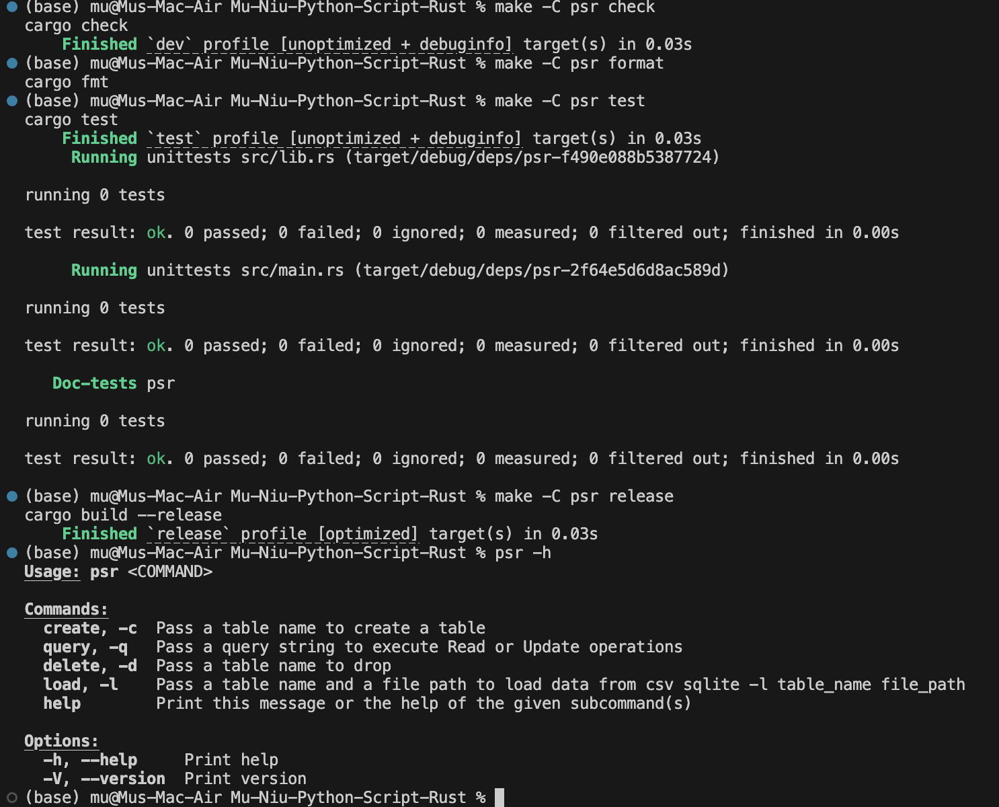

# Rust Project


## Project Structure

- **psr/src/main.rs**: The main script that uses the library functions and outputs results.
- **psr/src/lib.rs**: Contains core functions like create/drop table, load data and execute queries.
- **Makefile**: Automates tasks like building, testing, and linting.
- **Cargo.toml**: Project dependencies and settings for Rust.


  
## Automated Tasks

  - `make build`: Compiles the Rust code.
  - `make test`: Runs the tests in `lib.rs`.
  - `make lint`: Lints the code using `cargo clippy`.
  - `make format`: Formats code using `cargo fmt`.

Below is an image showing tools used for this project, including check, format, lint, test, release, and a help menu for the CLI tool.




In order to use our CLI normally, we have to run this in our terminal:

```{r}
export PATH=$PATH:/PATH TO YOUR REPO/sqlite/target/release
```

#### Binary Download Link

https://github.com/nogibjj/Mu-Niu-Python-Script-Rust/actions/runs/11493330152/artifacts/2097270549
